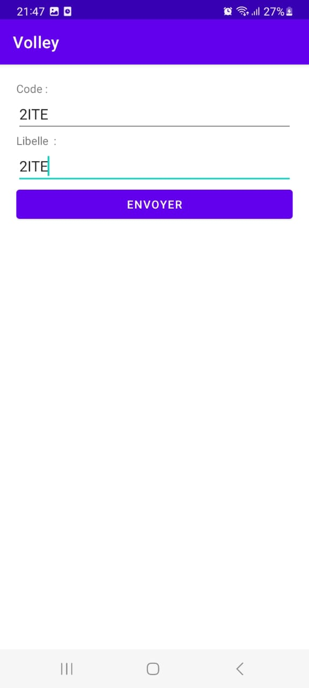

# schoolApp
Bienvenue dans l'application "schoolApp"
# Description
Une application de gestion des étudiants complète, permettant de gerer les données
personnelles des étudiants et de gérer efficacement les filières académiques.
# Capture d'ecran
Les tests Swagger ont été effectués avec succès, démontrant la robustesse et l'accessibilité de l'API.
### ajouter une filiere 
  
Output:
  
Get filiere 
 
Remplacer une filiere
 
Supprimer une filiere
 
 Partie mobile
 
interface d'accueil
 
gestion filiere
 
gestion etudiant
 
partie node js :gestion etudiant
 
gestion filiere

 
 

 

